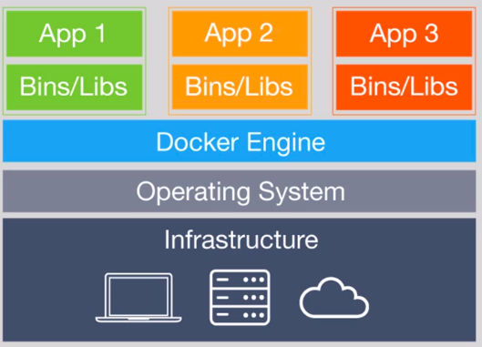
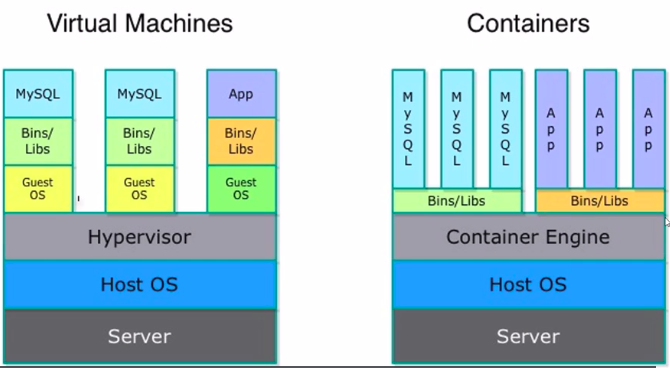
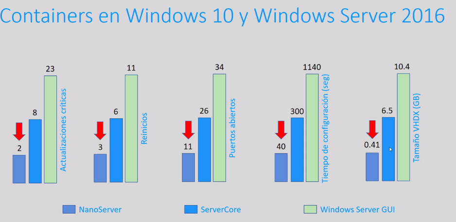
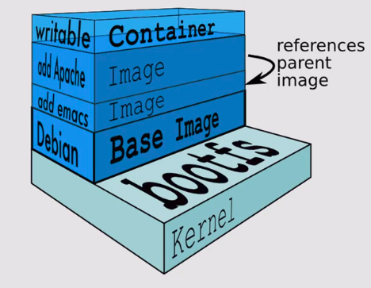

# learning-docker

Uso de docker y sus contenedores con UDEMY

## Intro
- Es una tecnología nueva, basada en contenedores de linux. Usada en windows.
- Docker permite desplegar apps rapidamente.
- Permite transporta apps de un host de docker a otro, de ubuntu, a fedora, a windows.

## Temas
- Creacion de contenedores.
- Dif entre contenedores e imagenes.
- Docker hub vs docker search.
- Contenedores interactivas.
- Docker commit, docker files.

### Que se necesita para el curso
- Ubuntu para los labs.
- TAmbién CentOS.
- Virtualbox
- Virmware
- En windows se descarga Docker for windows desde la página oficial.
- Los comandos de docker sirven para todas las plataformas.

### Cuales son las tecnologías que mas se usan en Docker?
- REgistry
- Nginx
- Redis
- Elasticsearch
- MySQL: DB
- Logspout:  Logs de los contenedors
- Quay: Graficos de monnitorización
- etcd: 
- Postgres: DB
- CADvisor: Métricas 

## Que es docker
- Docker es un proyecto de código abierto que automatiza el despliegue de aplicaciones dentro de contenedores de software, proporcionando una capa adicional de abstracción y automatización de virtualización de aplicaciones en múltiples sistemas operativos.
- Proyecto del 2013 para crear contenedores de aplicaciones.
- Que es un contenedor: Permite empaquetar o importar aplicaciones, y poder llevarlas a cualquier parte. Las imagenes de docker o containers
- Empaqueta apps, db, desarrollos en cualquier lenguaje. Con este se despliegan las apps.
- Docker nació en linux. 
- Docker es independiente de la plataforma.
- Docker contiene toda la infraestructura:

    - Por encima del OS se tiene el docker, por tal se usan los recursos del OS local.

### Características
- Autogestión
- Fiabilidad
- Desplegar multitud de contenedores en un mismo equipo físico.
- Corre en segundos.
- Contenedores livianos.
- DEspliega alta gama de aplicaciones.
- Con docker-hub se puede publicar dockers creados.
- Es multisistema
- Compartir nuestros contenedores creados a la comunidad..

### Diferencia entre un container y una máquina virtual.

- Tienen el mismo servidor, el mismo server.
- Los container tienen el container engine, las maq-virt tienen el hypervisor
- Los caintainer usan para todas sus imagenes los mismas librerías del sistema operativo host.
- No se tiene nigun sistema opertativo adicional virtualizado
- En el ejemplo hay 3 máquinas virtuales, en la que cada se tienen db y cada una tiene su guest OS. Lo cuál aumenta el tamaño de las máquinas virtuales.
- Con windows 10 también hay containers, con nano server. Que permiten despliegues de 40 seg.


### Instalar docker en ubuntu
ingresar a https://get.docker.com/

En la línea de comandos:
```
$ curl -fsSL https://get.docker.com -o get-docker.sh
$ sh get-docker.sh
```
Luego se le dan permisos al usuario del PC para ejecutar docker. Luego se debe abrir y cerrar la sesión.
```
$ sudo usermod -aG docker user
```
Verificar que está correcto, donde muestra el help de docker
```
$ docker
```
- La informacion de docker: Muestra contenedores y sus estados, las imagenes, las informacón del server. Versiones del kernel, del OS, arquitectura, etc.
```
$ docker info
```
- Para conocer la versión del cliente y la versión del servidor.
```
$ docker version
```

### Docker en windows 10 o MAC
- Se usa docker toolbox, lo cual instala docker engine, compose, machine, kitematik
- Se usaría una maquina virtual en virtualbox la cual correria el docker en windows
- Se ejecuta quick start terminal.

### Docker kinematic
En window o mac, es una solución para evitar comandos y ejecutar acciones con una interfaz gŕafica.

### En windows
- Docker for windows requiere windows profesional. Dockr nativo sin usar una mquina virtual con Hyper-V.
Un archivo .msi
- Usar powershell.

## Contenedores vs Imagenes de docker
Las imagenes son plantillas vacias para la creacion de contenedores. Se crean con docker hub o search.
Los contenedores contienen lo necesario para ejecutar las apps. Y las iamgenes crean los contenedores.

Por ejm, las imagenes de debian, de apache y de emac, sirven para crear el container. Todo corre sobre el kernel.

## imagenes con docker hub y docker search.
Las imagenes se descargan de Docker-hub, dispobnibles para la comunidad.
https://hub.docker.com/
Por ejm: se busca ubuntu, apache.
- Para buscar en la terminarl se usa *docker search*
```bash
#Busca imagenes en el docker hub
$ docker search ubuntu
```
- Para bajar las imagenes se usa *docker pull*
```bash
$ docker pull ubuntu
```

## Descargar imágenes y hacer tags con docker pull.
```bash
$ docker pull ubuntu
# muestra el tag: latest, que está por defecto. La imagen se compone de varias imagenes.
```
- Para listar las imagenes descargadas y ver su ubicación
```
$ docker images
```
Los tags son las versiones de las imagenes, al enlistar se muestra lo siguiente
```
REPOSITORY          TAG                 IMAGE ID            CREATED             SIZE
ubuntu              latest              7698f282e524        2 weeks ago         69.9MB
```
- Para buscar un tag particular
```bash
$ docker search ubuntu:14.04
$ docker pull ubuntu:14.04
```

## Primer container hello-world
```
$ docker pull hello-world
$ docker run hello-world

Hello from Docker!
This message shows that your installation appears to be working correctly.
```
- Para saber los containers en ejecución
```bash
$ docker ps

# Los comandos creados y ejecutados.
$ docker ps -a
```
## Ejecutar comandos dentro de los containers
```
$ docker run ubuntu ls
$ docker run -i -t ubuntu bash
```
Ingresa al contendor de linux, el cual no se ha terminado de ejecutar. Si se mira con el ps, aparece en ejecución.


##Listar imagenes
```bash
# Todas las imagenes
$ docker images -a 

# filtrar
$ docker iamges -f

# muestra ids
$ docker images -q
```

## Contenedores en ejecución
```
$ docker ps
$ docker ps -a
$ docker ps --help
```

## Contenedores interactivos

